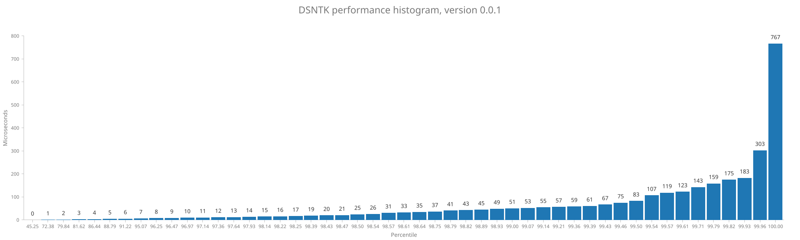

# DSNTK performance report

### Version v0.0.1

Total number of samples: **2802**

| Statistic |   Time |
|----------:|-------:|
|       Min |   0 µs |
|       Max | 767 µs |
|      Mean |   3 µs |
|    StdDev |  19 µs |

Percentage of samples executed in less than specified time

| Percentage |   Time | Samples |
|-----------:|-------:|:--------|
|      45.3% |   0 µs | 1268    |
|      72.4% |   1 µs | 2028    |
|      79.8% |   2 µs | 2237    |
|      81.6% |   3 µs | 2287    |
|      86.4% |   4 µs | 2422    |
|      88.8% |   5 µs | 2488    |
|      91.2% |   6 µs | 2556    |
|      95.1% |   7 µs | 2664    |
|      96.3% |   8 µs | 2697    |
|      96.5% |   9 µs | 2703    |
|      97.0% |  10 µs | 2717    |
|      97.1% |  11 µs | 2722    |
|      97.4% |  12 µs | 2728    |
|      97.6% |  13 µs | 2736    |
|      97.9% |  14 µs | 2744    |
|      98.1% |  15 µs | 2750    |
|      98.2% |  16 µs | 2752    |
|      98.3% |  17 µs | 2753    |
|      98.4% |  19 µs | 2757    |
|      98.4% |  20 µs | 2758    |
|      98.5% |  21 µs | 2759    |
|      98.5% |  25 µs | 2760    |
|      98.5% |  26 µs | 2761    |
|      98.6% |  31 µs | 2762    |
|      98.6% |  33 µs | 2763    |
|      98.6% |  35 µs | 2764    |
|      98.8% |  37 µs | 2767    |
|      98.8% |  41 µs | 2768    |
|      98.8% |  43 µs | 2769    |
|      98.9% |  45 µs | 2771    |
|      98.9% |  49 µs | 2772    |
|      99.0% |  51 µs | 2774    |
|      99.1% |  53 µs | 2776    |
|      99.1% |  55 µs | 2778    |
|      99.2% |  57 µs | 2780    |
|      99.4% |  59 µs | 2784    |
|      99.4% |  61 µs | 2785    |
|      99.4% |  67 µs | 2786    |
|      99.5% |  75 µs | 2787    |
|      99.5% |  83 µs | 2788    |
|      99.5% | 107 µs | 2789    |
|      99.6% | 119 µs | 2790    |
|      99.6% | 123 µs | 2791    |
|      99.7% | 143 µs | 2794    |
|      99.8% | 159 µs | 2796    |
|      99.8% | 175 µs | 2797    |
|      99.9% | 183 µs | 2800    |
|     100.0% | 303 µs | 2801    |
|     100.0% | 767 µs | 2802    |

