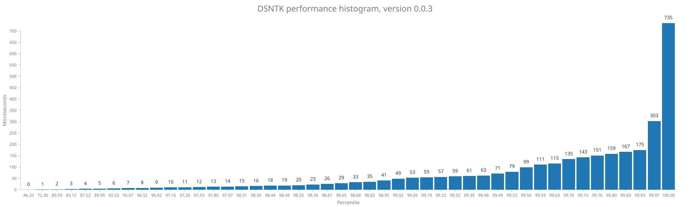

# DSNTK performance report

### Version v0.0.3

Total number of samples: **2957**

| Statistic |   Time |
|----------:|-------:|
|       Min |   0 µs |
|       Max | 735 µs |
|      Mean |   3 µs |
|    StdDev |  18 µs |

Percentage of samples executed in less than specified time

| Percentage |   Time | Samples |
|-----------:|-------:|:--------|
|      46.2% |   0 µs | 1366    |
|      72.3% |   1 µs | 2138    |
|      80.6% |   2 µs | 2383    |
|      83.1% |   3 µs | 2458    |
|      87.5% |   4 µs | 2588    |
|      90.0% |   5 µs | 2661    |
|      92.6% |   6 µs | 2739    |
|      95.7% |   7 µs | 2829    |
|      96.5% |   8 µs | 2854    |
|      96.9% |   9 µs | 2866    |
|      97.2% |  10 µs | 2873    |
|      97.3% |  11 µs | 2876    |
|      97.5% |  12 µs | 2884    |
|      97.8% |  13 µs | 2892    |
|      98.0% |  14 µs | 2897    |
|      98.3% |  15 µs | 2907    |
|      98.3% |  16 µs | 2908    |
|      98.4% |  18 µs | 2911    |
|      98.5% |  19 µs | 2912    |
|      98.5% |  20 µs | 2914    |
|      98.6% |  23 µs | 2915    |
|      98.6% |  26 µs | 2916    |
|      98.6% |  29 µs | 2917    |
|      98.7% |  33 µs | 2918    |
|      98.8% |  35 µs | 2922    |
|      99.0% |  41 µs | 2926    |
|      99.0% |  49 µs | 2928    |
|      99.1% |  53 µs | 2929    |
|      99.2% |  55 µs | 2933    |
|      99.2% |  57 µs | 2934    |
|      99.3% |  59 µs | 2937    |
|      99.4% |  61 µs | 2939    |
|      99.5% |  63 µs | 2941    |
|      99.5% |  71 µs | 2942    |
|      99.5% |  79 µs | 2943    |
|      99.6% |  99 µs | 2944    |
|      99.6% | 111 µs | 2945    |
|      99.6% | 115 µs | 2946    |
|      99.7% | 135 µs | 2948    |
|      99.7% | 143 µs | 2949    |
|      99.8% | 151 µs | 2950    |
|      99.8% | 159 µs | 2951    |
|      99.8% | 167 µs | 2952    |
|      99.9% | 175 µs | 2955    |
|     100.0% | 303 µs | 2956    |
|     100.0% | 735 µs | 2957    |

