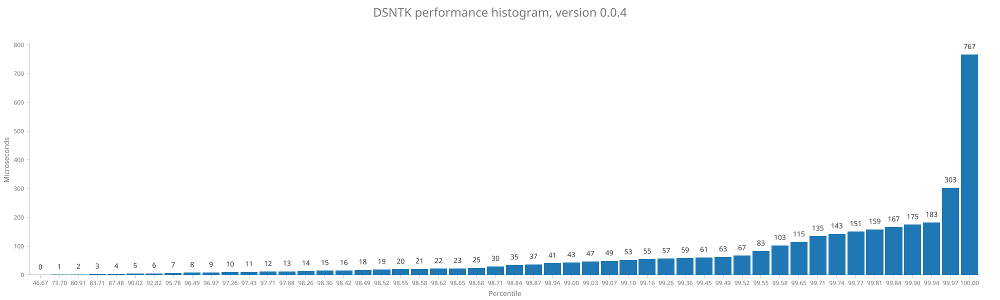

# DSNTK performance report

### Version v0.0.4

Total number of samples: **3107**

| Statistic |   Time |
|----------:|-------:|
|       Min |   0 µs |
|       Max | 767 µs |
|      Mean |   3 µs |
|    StdDev |  18 µs |

Percentage of samples executed in less than specified time

| Percentage |   Time | Samples |
|-----------:|-------:|:--------|
|      46.7% |   0 µs | 1450    |
|      73.7% |   1 µs | 2290    |
|      80.9% |   2 µs | 2514    |
|      83.7% |   3 µs | 2601    |
|      87.5% |   4 µs | 2718    |
|      90.0% |   5 µs | 2797    |
|      92.8% |   6 µs | 2884    |
|      95.8% |   7 µs | 2976    |
|      96.5% |   8 µs | 2998    |
|      97.0% |   9 µs | 3013    |
|      97.3% |  10 µs | 3022    |
|      97.4% |  11 µs | 3027    |
|      97.7% |  12 µs | 3036    |
|      97.9% |  13 µs | 3041    |
|      98.3% |  14 µs | 3053    |
|      98.4% |  15 µs | 3056    |
|      98.4% |  16 µs | 3058    |
|      98.5% |  18 µs | 3060    |
|      98.5% |  19 µs | 3061    |
|      98.6% |  20 µs | 3062    |
|      98.6% |  21 µs | 3063    |
|      98.6% |  22 µs | 3064    |
|      98.6% |  23 µs | 3065    |
|      98.7% |  25 µs | 3066    |
|      98.7% |  30 µs | 3067    |
|      98.8% |  35 µs | 3071    |
|      98.9% |  37 µs | 3072    |
|      98.9% |  41 µs | 3074    |
|      99.0% |  43 µs | 3076    |
|      99.0% |  47 µs | 3077    |
|      99.1% |  49 µs | 3078    |
|      99.1% |  53 µs | 3079    |
|      99.2% |  55 µs | 3081    |
|      99.3% |  57 µs | 3084    |
|      99.4% |  59 µs | 3087    |
|      99.5% |  61 µs | 3090    |
|      99.5% |  63 µs | 3091    |
|      99.5% |  67 µs | 3092    |
|      99.5% |  83 µs | 3093    |
|      99.6% | 103 µs | 3094    |
|      99.6% | 115 µs | 3096    |
|      99.7% | 135 µs | 3098    |
|      99.7% | 143 µs | 3099    |
|      99.8% | 151 µs | 3100    |
|      99.8% | 159 µs | 3101    |
|      99.8% | 167 µs | 3102    |
|      99.9% | 175 µs | 3104    |
|      99.9% | 183 µs | 3105    |
|     100.0% | 303 µs | 3106    |
|     100.0% | 767 µs | 3107    |

